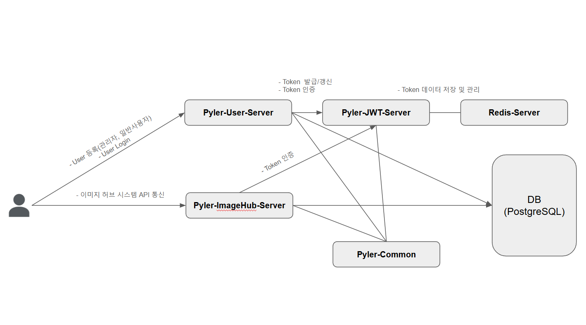
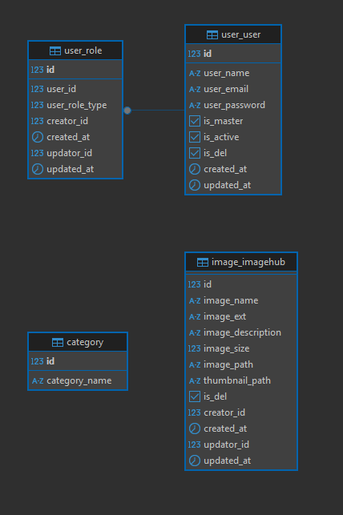

# pyler2025
Pyler 과제 전형

실행방법

1. 실행하고자 하는 host에 Docker 및 Docker-compose 설치 필수.
2. root project 경로에서, docker-compose up -d 명령어 실행
3. docker hub로 부터 image를 pull 한뒤, 각 모듈별 dockerfile image 생성 및 container 실행 자동화

구성:
- 멀티 모듈로 구성하였으며, 모듈별 역할은 아래와 같습니다.
- pyler-common : 공통 모듈 역할
- pyler-jwt-server: JWT 생성 및 인증등의 전반적인 tokent(AccessToken, RefreshToken) 생명주기 관리 APP
- pyler-user-server: 사용자 관리 APP
- pyler-imagehub-server: 이미지 허브 시스템 관리 App
- plyer-db: PostgreSQL DB
- plyer-redis: JWT Token DB

API 명세서
- https://documenter.getpostman.com/view/15973945/2sAYdkGoky

테스트 방법:
- 회원가입 API 진행
- 가입된 email 계정 및 패스워드 기준으로 로그인 API 진행 후, 발급된 accesstoken를 header의 bearer Token으로 활용

- App Server Flow

- ERD 관계도
- 

- 테이이블 스키마 정의서: pyler-db-server내 create.sql